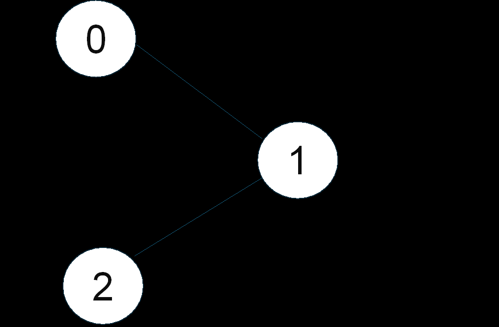
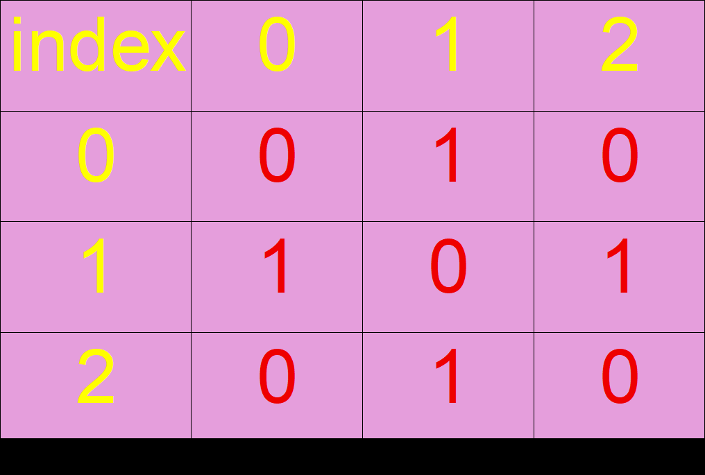
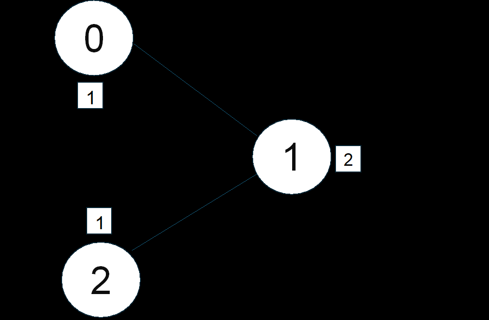

Suppose this is the graph whose implementation is done by an adjacency matrix.

Now if nodes(v)=3 and color(m)=2

The recursion tree will look like:- 

             terminates once  f(0)
             signalled 'true'  ||
                        ↑      || 
                  return true  || m=1
                        ↑      ||
                              f(1)
                        ↑      ||
                  return true  || m=2
                        ↑      ||
                              f(2)
                               ||
                  return true  || m=1
                        ↑       ||
                              f(3)

This shows the color in each node.

Suppose now the color is m=1, the graph is not colored.

       'terminates'  f(0)
                      ||
               ↑      ||
         return false || m=1
               ↑      ||
                     f(1)
               ↑      ||
         return false || m = no option as color 1 is
               ↑      ||     already present in node 
                      ||     '0' which is adjacent to '1'
                     f(2)
                  

TIME COMPLEXITY - O(m^N * N)

*  The time complexity is exponential due to the recursive nature and exploration of all possible color combinations.

SPACE COMPLEXITY - O(N) + O(N), one extra auxiliary space is used.
